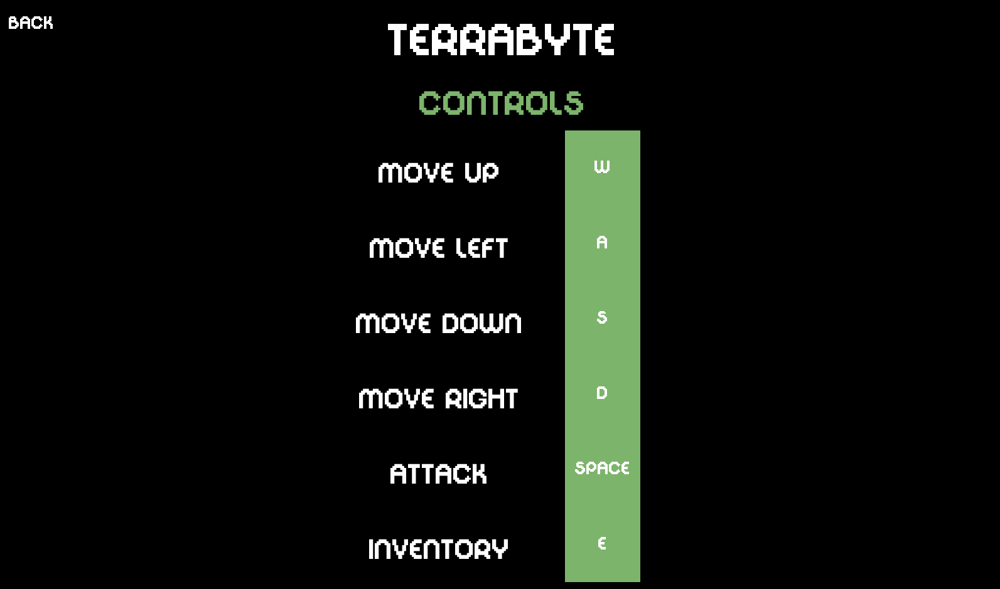
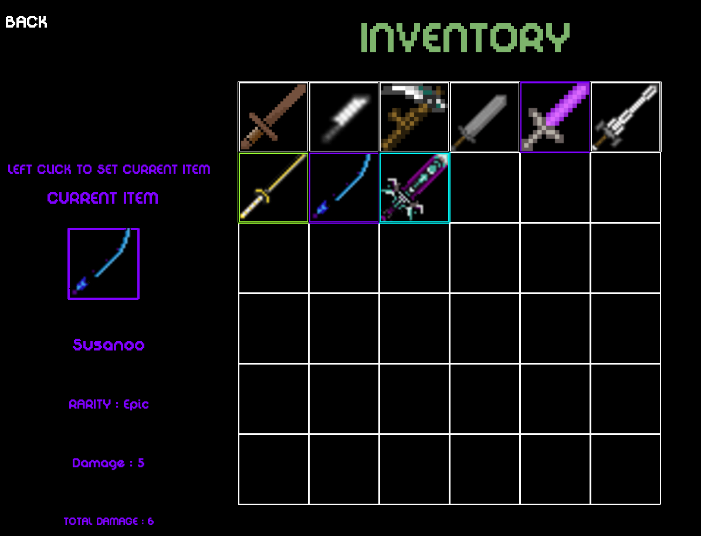
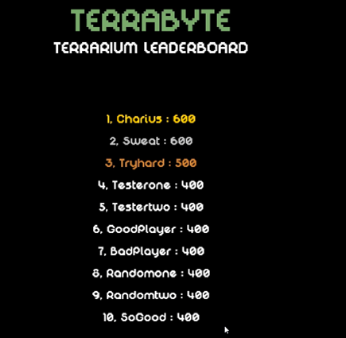
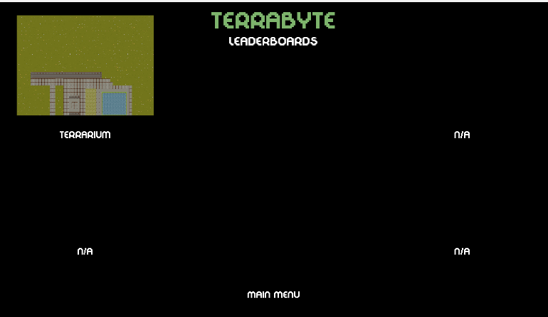
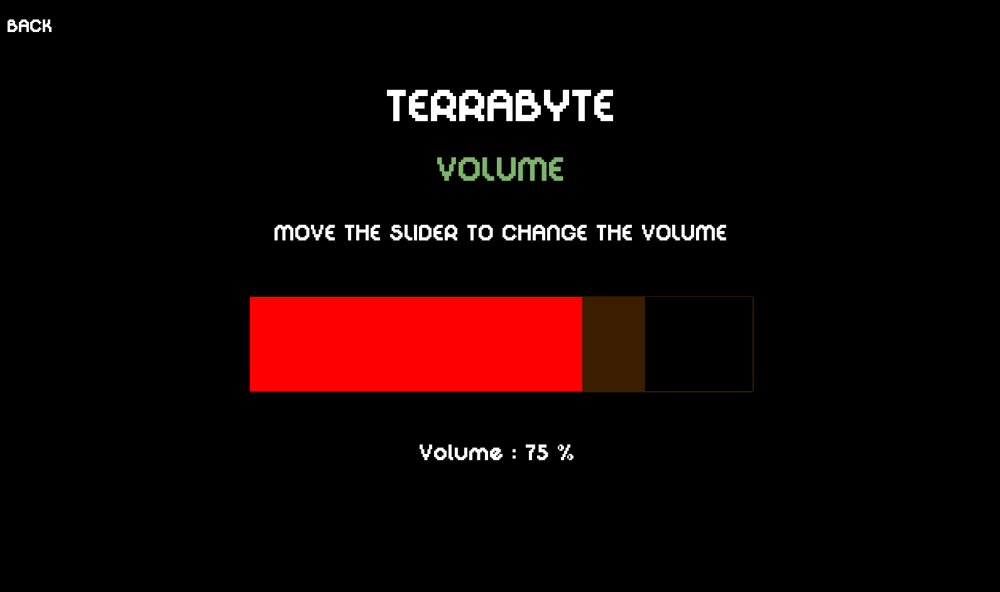

## Welcome to Terrabyte, an engaging 2D top-down dungeon crawler where your goal is to gain points by slaying enemies and collecting mythical items. Will you be the one to achieve the highest score in each specific dungeon?

## Control System

In Terrabyte, navigate through dungeons using intuitive controls for a seamless gaming experience.

## Inventory Management

Manage your collected mythical items efficiently using the in-game inventory system.

## Leaderboard Display

Compete with others and track your progress on the global leaderboard.

## Leaderboard Menu

Access the leaderboard menu to view top players and challenge their scores.

## Volume Settings

Adjust the volume settings to personalize your gaming environment.

Explore these features and elevate your gaming experience with Terrabyte!

For detailed instructions and gameplay tips, refer to the game manual or documentation.

## Gameplay Overview

- **Objective:** Gain as many points as possible within 60 seconds by navigating through dungeons, defeating enemies, and collecting valuable mythical items.
- **Gameplay Time:** You have a limited 60-second window to explore and conquer each dungeon.
- **Challenge:** Encounter various enemies, each with unique abilities and difficulties.
- **Rewards:** Collect mythical items scattered throughout the dungeon to boost your score and enhance your abilities.

## Features

- **2D Top-Down Perspective:** Enjoy the immersive gameplay experience in a top-down view.
- **Enemy Variety:** Encounter a diverse range of enemies, each requiring different strategies to defeat.
- **Mythical Items:** Collect valuable items with magical properties to enhance your score and gameplay.
- **Time-Limited Challenge:** Feel the thrill of time pressure as you strive to maximize your score within 60 seconds.

## How to Play

1. **Controls:** Use `WASD` keys to navigate and `Spacebar` to attack enemies. Use `ESC` to return to main menu.
2. **Scoring:** Slay enemies and collect mythical items to accumulate points.
3. **Dungeon Challenge:** Each dungeon presents a unique challenge to complete within the time limit.
   
## Getting Started

- **Installation:** zip repo -> exe/main -> Terrabyte.exe
